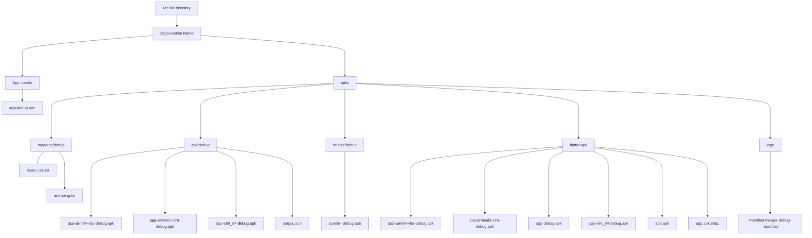

## Read me

### File structure
                                                       

```mermaid
flowchart TD
  A[Mobile directory] -->B[Organization Name];
  B ----> C[apks];
  B ----> D[App bundle];
  
  D --> app-debug.aab
  C ----> E[apk/debug];
  C ----> F[bundle/debug];
  C ----> G[flutter-apk];
  C ----> H[logs];
  C ----> I[mapping/debug];
  H ---->J[manifest-merger-debug-report.txt];
  E ---->K[app-arm64-v8a-debug.apk];
  E ---->L[app-armeabi-v7a-debug.apk];
  E ---->M[app-x86_64-debug.apk];
  E ---->N[output.json];
  F ---->O[bundle--debug.aab];
  G ---->P[app-arm64-v8a-debug.apk];
  G ---->Q[app-armeabi-v7a-debug.apk];
  G ---->R[app-debug.apk];
  G ---->S[app-x86_64-debug.apk];
  G ---->T[app.apk];
  G ---->U[app.apk.sha1];
  I --->V[ammping.txt];
  I ---W[resources.txt];
```
